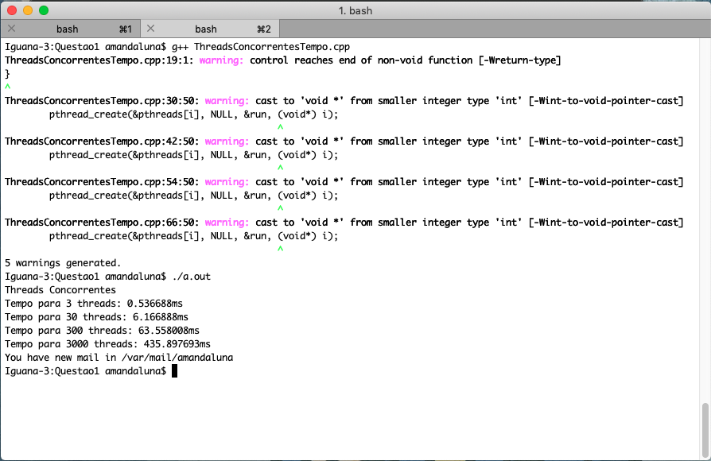
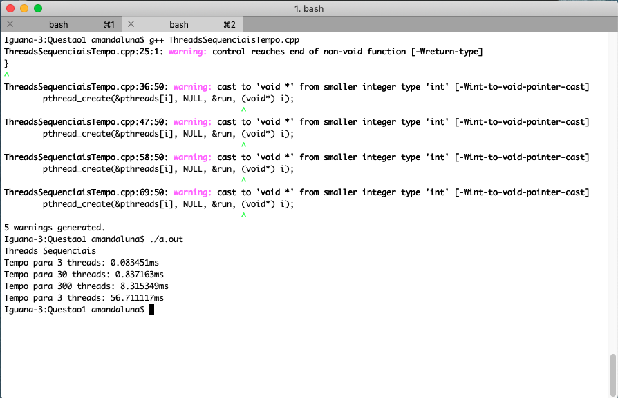
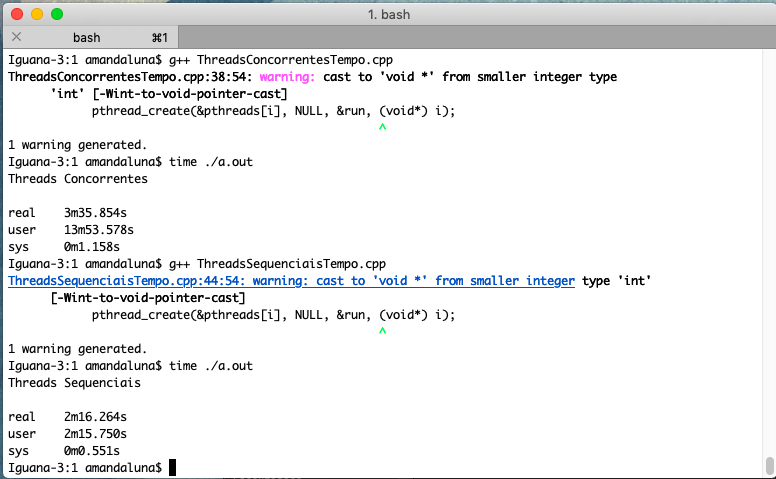

### Questão 1 - Em sala, mostramos o seguinte trecho de código (desprotegido). Nesse código, três threads incrementam um contador compartilhado. Cada thread realiza 10.000.000 operações de incremento. Modifique o código para que nenhum incremento seja perdido, e, ao fim da execução do programa, o valor do contador seja 30.000.000. Execute experimentos para coletar o tempo de execução de cada uma das duas versões do programa. Explique a razão da diferença de desempenho. Forneça evidências que corroborem sua explicação (no Linux, você pode usar as ferrametnas eBPF e perf, por exemplo).

#### Solução para que nenhum incremento seja perdido

* Como dito no enunciado da questão, as três threads do programa incrementam um contador de forma compartilhada, ou seja, a área do código em que ocorre tal incremento é dita como região crítica, em que ocorrem condições de corrida entre as threads.
* Para que não houvessem condições de corrida, foi preciso pensar em alguma solução que garantisse exclusão mútua entre as threads, ou seja, que apenas uma thread por vez entrasse na região crítica e nenhuma outra que tentasse tal feito obtivesse sucesso. Portanto, utilizou-se um mutex para solucionar o problema, dado que os mutex são feitos para sinalizar quando regiões críticas de código precisam de acesso exclusivo, impedindo que outras threads com a mesma proteção sejam executadas simultaneamente e acessem os mesmos locais de memória.
* O código da solução encontra-se [aqui](https://github.com/dalesEwerton/PC-Lista1/blob/master/1/ThreadsSequenciais.cpp) e as linhas utilizadas para solução foram da _17_ até a _21_. 
* Já o código original encontra-se [aqui](https://github.com/dalesEwerton/PC-Lista1/blob/master/1/ThreadsConcorrentes.cpp).
Foram feitas algumas pequenas mudanças no código disponibilizado pelo professor, para que este executasse nas máquinas dos alunos. Porém, o fluxo e execução original não foram alterados.

#### Por que as threads sequenciais tiveram um tempo de execução menor?

Imagem 01 - Compilação e tempo de execução das threads concorrentes

Imagem 02 - Compilação e tempo de execução das threads sequenciais

Imagem 03 - Gráfico comparando o tempo de execução das threads concorrentes com as sequenciais

* No gráfico acima, podemos notar que o tempo de execução das threads concorrentes vai aumentando bem mais do que os das threads sequenciais.

* Um possível fator que influencia no tempo de execução é que as threads que executam de forma concorrente ficam disputando a CPU entre si, ou seja, elas não completam o que precisam fazer, dado que passam apenas uma quantidade de tempo na CPU e quando este tempo acaba, outra thread entra no lugar, fazendo com que a execução da anterior seja interrompida e necessite esperar que outra thread perca a CPU para ter uma chance de entrar lá novamente. Portanto, ocorrem muitas trocas de contexto dentro deste problema, que consomem tempo, além do tempo que a thread precisa esperar para executar. 
* Já na execução de forma sequencial, não há tantas trocas de contexto e, como ocorre exclusão mútua, cada thread precisa esperar a que está na vez executar todo o programa, para, após isso, entrar na CPU e executar o que precisa ser executado. Ou seja, como não há tantas trocas de contexto nem interrupções na execução e tantas esperas para entrar na CPU, a execução de forma sequencial torna-se mais rápida.
* Um outro fator que pode influenciar no tempo é que o tempo gasto fazendo operações em cada iteração no programa é muito pequeno e há uma sobrecarga bastante significativa envolvida na criação e no gerenciamento de várias threads. No caso, o uso de threads só aumenta a eficiência quando cada iteração é suficientemente cara em termos de tempo do processador.

Buscando expandir a análise dos tempos de execução, executamos o comando _time_ do terminal na execução de ambas implementações. O resultado segue abaixo:

Imagem 04 - Resultado do comando time na execução das implementações

* Com isso, temos que, o tempo _real_ refere-se ao tempo que foi gasto do início ao fim da chamada, incluindo o tempo usado por outros processos e o tempo que o processo gasta bloqueado. Já o tempo _user_ é o tempo real da CPU usado na execução do processo. Para saber o tempo total gasto pela CPU devemos somar o tempo _user_ com o tempo _sys_.
* No caso das threads concorrentes, o tempo da CPU é bem maior do que o tempo real, ou seja, o gasto de CPU foi bem maior. Isto poderia ser causado pelo já foi explicitado aqui, dado que com o uso threads concorrentes ocasionam condições de corrida e várias trocas de contexto, que dão origem a operações custosas e o programa inteiro demora mais para terminar a execução.
* Já nas threads sequenciais, vemos que o tempo _real_ é praticamente igual ao gasto pela CPU. Isto pode ser explicado pelo fato de que, quando uma thread entra na CPU, ela só sai de lá quando terminar sua execução, ou seja, salvo em condições de exceções e erros, não haverão condicões de corrida e consequentemente também não haverão muitas trocas de contexto, fazendo com que o tempo de processamento de fato seja mais rápido.

