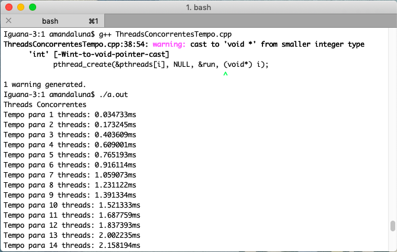
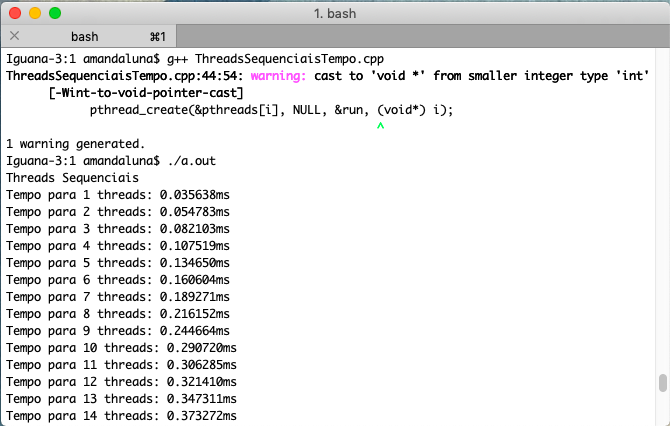
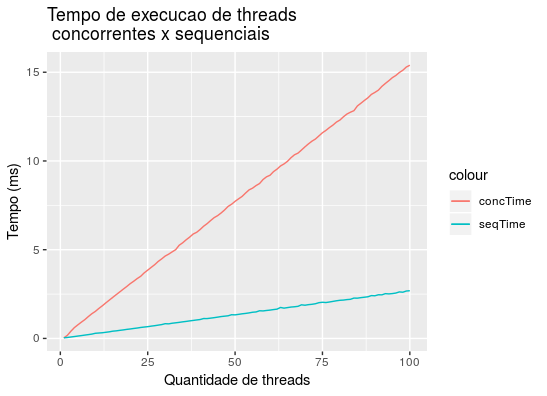
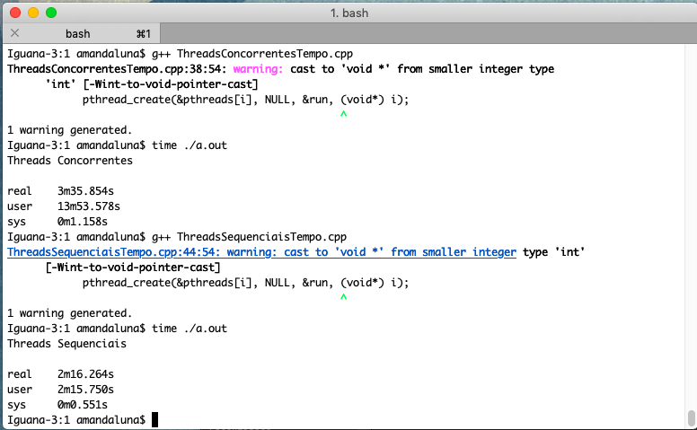
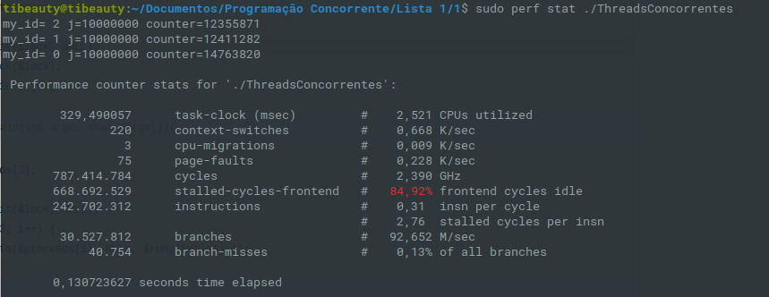
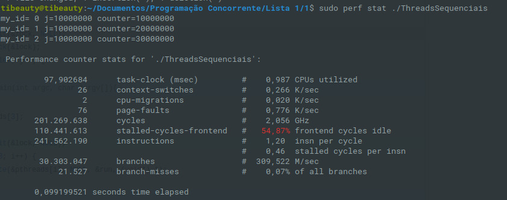

### Problem Description

In an unprotected code snippet, three threads increment a shared counter. Each thread performs 10,000,000 increment operations. Modify the code so that no increment is lost, and at the end of program execution the counter value is 30,000,000. Run experiments to collect the runtime of each of the two versions of the program. Explain the reason for the performance difference. Provide evidence to support your explanation (on Linux, you can use eBPF and perf tools, for example).

#### Solution to not miss any increment

* As stated in the statement of the question, the program's three threads increment a counter in a shared way, that is, the area of ​​code in which such an increment occurs is said to be a critical region, where race conditions occur between the threads.
* In order not to have race conditions, we had to think of a solution that would guarantee mutual exclusion between the threads, that is, only one thread at a time would enter the critical region and no other that tried to do so would succeed. Therefore, a mutex was used to solve the problem, as mutexes are meant to signal when critical code regions need exclusive access, preventing other threads with the same protection from running concurrently and accessing the same memory locations.
* The solution is [here](./SequentialThreads.c) and the lines used for solution were from _17_ to _21_. 
* Already the original code is [here](./ConcurrentThreads.c).
Some minor changes were made to the code made available by the teacher to run on the students' machines. However, the original flow and execution did not change.

#### Why did sequential threads have a shorter runtime ?

  

  Image 01 - Compilation and runtime of concurrent threads

  

    Image 02 - Compilation and runtime of sequential threads

  

    Image 03 - Graph comparing runtime of concurrent threads with sequential threads

* In the graph above, we can see that the execution time of concurrent threads is increasing much more than the sequential threads.

* A possible factor influencing runtime is that threads that run concurrently are vying for CPU, ie they do not complete what they need to do as they only spend a lot of time on the CPU and when time is up, another thread goes into place, causing execution of the previous one to be interrupted and need to wait for another thread to lose CPU to have a chance to get there again. Therefore, many context switches occur within this problem, which are time consuming as well as the time the thread has to wait to execute.
* Already running sequentially, there is not so much context switching and, as mutual deletion occurs, each thread needs to wait for the entire program to execute, then enter the CPU and execute what needs to be executed. . That is, since there are not so many context switches or execution interruptions and so many waits to get into the CPU, sequential execution becomes faster.
* Another factor that can influence time is that the time spent doing operations on each iteration in the program is very small and there is a very significant overhead involved in creating and managing multiple threads. In this case, the use of threads only increases efficiency when each iteration is sufficiently expensive in terms of processor time.

Seeking to expand the analysis of runtimes, we execute the terminal _time_ command in the execution of both implementations. The result follows below:

  

    Imagem 04 - Resultado do comando time na execução das implementações

* Thus, we have that _real_ time refers to the time that was spent from start to finish of the call, including the time used by other processes and the time the process spends blocked. The _user_ time is the actual CPU time used to execute the process. To know the total time spent by the CPU we must add the time _user_ with the time _sys_.
* In the case of concurrent threads, the CPU time is much longer than the real time, that is, the CPU expense was much higher. This could be caused by what has already been explained here, since using concurrent threads causes race conditions and various context changes, which result in costly operations and the entire program takes longer to finish executing.
* In sequential threads, we see that _real_ time is practically equal to the time spent by the CPU. This can be explained by the fact that when a thread enters the CPU, it only leaves the CPU when it finishes its execution, that is, except in exception and error conditions, there will be no race conditions and consequently there will not be many exchanges. context, making the actual processing time faster.

The images below show the statuses when executing concurrent and sequential codes.

  

    Imagem 05 - Resultado da execução do comando perf para o código concorrente

  

    Imagem 06 - Resultado da execução do comando perf para o código sequencial

As we can see, the concurrent code used `0.668 k/sec` performing context switching while the sequential only `0.266 k/sec` and also, the concurrent code spent a lot more CPU. Confirming the hypothesis that the time of context switching between threads is significant for this example and is the main reason for the sequential experiment to get a shorter execution time than the concurrent experiment.
